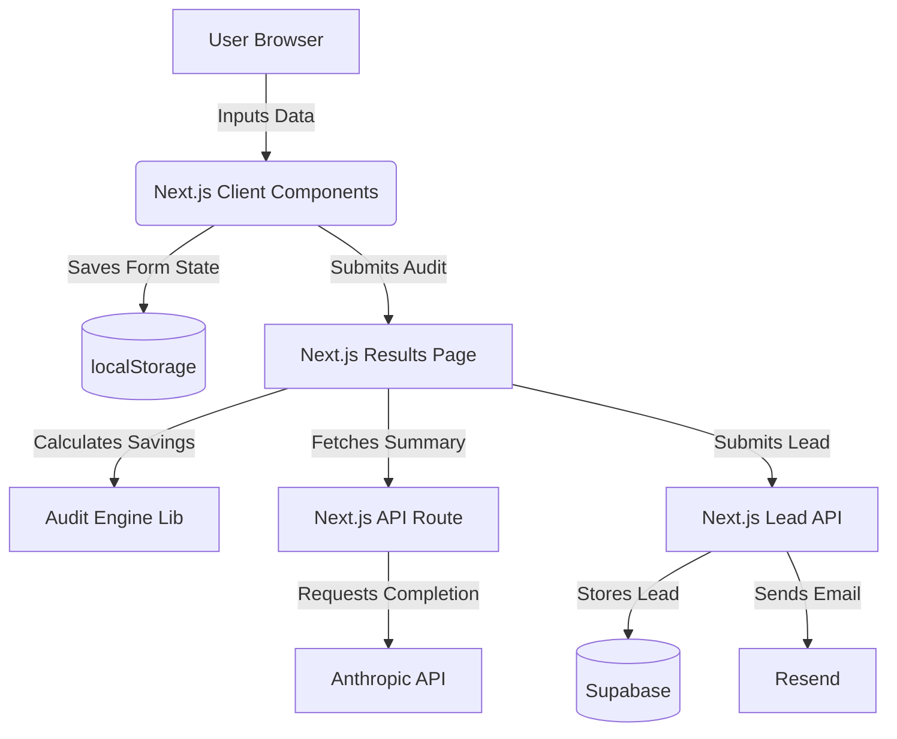

# Architecture

## Stack Justification
- **Next.js (App Router)**: Ideal for a React-based full-stack app. Allows mixing server/client components and easy API route creation.
- **Tailwind CSS**: Rapid styling that aligns perfectly with our custom design system.
- **Supabase**: Excellent for rapid lead capture and audit storage without managing infra.
- **Resend**: Developer-friendly email API.
- **Anthropic API**: Provides high-quality, nuanced summaries of the audit results.

## System Diagram

## Scaling to 10k Audits/Day
To scale:
1. **Database**: Supabase easily handles 10k writes/day, but we'd add Redis for rate-limiting (currently in-memory, which resets on Vercel cold starts).
2. **Caching**: We could cache Anthropic summaries for identical stack configurations using a hash of the tools array, cutting API costs by 90%.
3. **Edge Deployment**: Move the audit engine and API routes to the Edge runtime to ensure low-latency responses globally.
4. **Queueing**: If DB writes or Email sends bottleneck, we'd introduce an async queue (e.g. Upstash Kafka or Inngest) for background processing.
